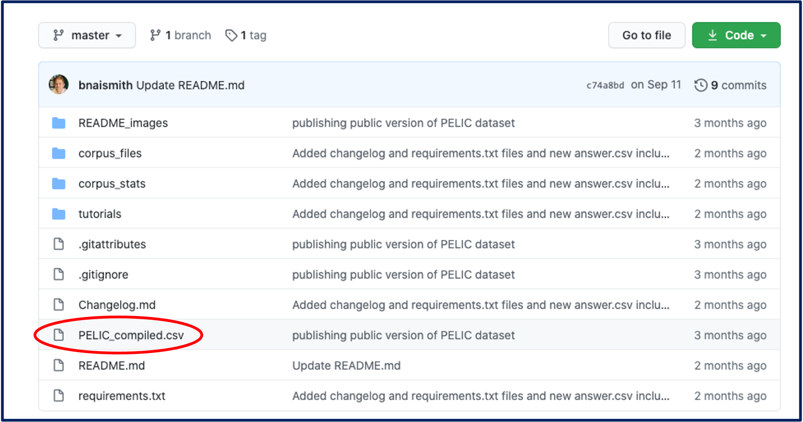
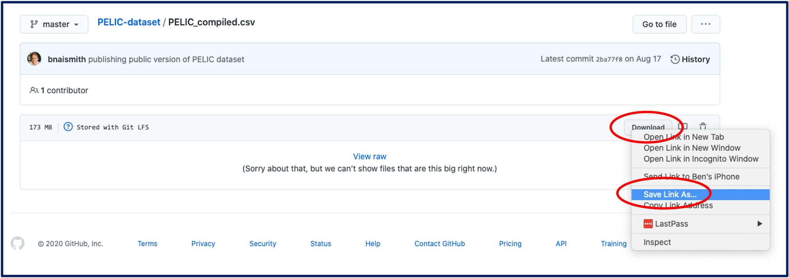
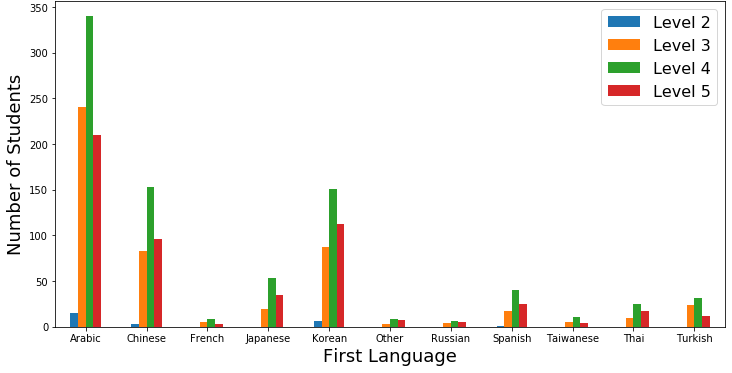
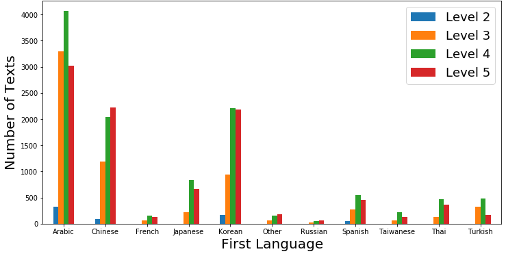

# The University of Pittsburgh English Language Institute Corpus (PELIC)

**Version 1.1  
Authors: Alan Juffs, Na-Rae Han, Ben Naismith  
Contact: bnaismith@pitt.edu**

[](https://zenodo.org/badge/latestdoi/288275880)

This repository contains the dataset, as well as additional tools and tutorials, for the University of Pittsburgh English Language Institute Corpus (PELIC).

**Corpus citation:**  
Juffs, A., Han, N-R., & Naismith, B. (2020). The University of Pittsburgh English Language Corpus (PELIC) [Data set]. http://doi.org/10.5281/zenodo.3991977

<br>

### Download instructions
To download the dataset, we strongly recommend using [GitHub](https://github.com/) and [cloning the entire repository](https://docs.github.com/en/free-pro-team@latest/github/creating-cloning-and-archiving-repositories/cloning-a-repository). This will provide you will all the files on your local computer. Because of the file sizes, it is necessary to use [git-lfs](https://git-lfs.com/) (Git Large File Storage).  

To download a file without using a GitHub account, follow the procedure below:  
1. Click on the filename you wish to download, e.g. `PELIC_compiled.csv`.  
  
2. Right-click on the `Download` button and select `Save Link As...`.  
  
3. Change the extension from `.txt` to `.csv` before saving.
  
**Important:** By manipulating files, there is always the danger of introducing errors into the data. Any data manipulation should be clearly stated in work resulting from these data.

<br>

## Table of contents
1. [Overview](#1-Overview)
2. [Corpus description](#2-Corpus-description)
3. [Data collection and processing](#3-Data-collection-and-processing)
4. [Dataset contents](#4-Dataset-contents)
    - [answer.csv](#answercsv)
    - [course.csv](#coursecsv)
    - [question.csv](#questioncsv)
    - [student_information.csv](#student_informationcsv)
    - [test_scores.csv](#test_scorescsv)
    - [PELIC_compiled.csv](#PELIC_compiledcsv)
5. [Additional resources](#5-Additional-resources)
    - [Corpus stats](#Corpus-stats)
    - [Tutorials](#Tutorials)
6. [Pitt ELI Toolkit (pelitk)](#6-pitt-eli-toolkit-pelitk)
    - [Lexical sophistication](#Lexical-sophistication)
    - [Concordancing](#Concordancing)
7. [PELIC spelling](#7-pelic-spelling)
8. [Future data release](#8-Future-data-release)
9. [References](#9-References)
10. [Changelog](#10-Changelog)
11. [License](#11-License)

<br>

## 1. Overview
This `README.md` file introduces the dataset for the University of Pittsburgh English Language Institute Corpus (PELIC), a large learner corpus of written and spoken texts. These texts were collected in an English for Academic Purposes (EAP) context over seven years in the University of Pittsburgh’s Intensive English Program, and were produced by students with a wide range of linguistic backgrounds and proficiency levels. Unlike most learner corpora which are cross-sectional (Callies, 2015), PELIC is longitudinal, offering greater opportunities for tracking development in a natural classroom setting.

In Section 2 we describe some of the key characteristics of this corpus, and Section 3 addresses how the data were collected and processed. Section 4 provides information about each of the files corpus in the repository so that they may be easily accessed and used for linguistic research. Sections 5, 6 and 7 look at accompanying bespoke resources for processing this, or other, corpus data. Finally, Section 8 suggests possible avenues for future data release and development.

Overall, the corpus contributes to the field of learner corpus research by adding to the pool of freely and publicly available learner corpora, supplemented by a useful set of tools and tutorials for accessing these data. For information regarding publications and presentations based on PELIC data, as well as for information regarding the people and parties responsible for the corpus, please visit the [Pitt ELI Corpus](https://eli-data-mining-group.github.io/Pitt-ELI-Corpus/) web page.

<br>

## 2. Corpus description
PELIC is based on data collected from students at the [English Language Institute (ELI)](http://www.eli.pitt.edu) at the University of Pittsburgh from 2005-2012 as part of the [National Science Foundation project](http://learnlab.org) housed at Pitt and CMU. The Intensive English Program (IEP) at the ELI was one of seven site partners with the Pittsburgh Science of Learning Center that provided in vivo research contexts. Part of this research was collecting data from learners; other components were experimental. The IEP data include written and spoken production from writing, grammar, reading, and speaking classes. At present, the written data is publicly available (though see [Future Data Release](#8-Future-Data-Release)).

Table 1 provides the basic statistics regarding the composition and size of PELIC, and Figure 1 (Juffs, 2020) presents a snapshot of the first languages (L1s) of the students. L1s represented by the largest number of students are Arabic, Chinese, Japanese, Korean, Spanish, and Turkish. Levels of proficiency in the dataset range from Level 2 (approximately equal to the [Common European Framework (CEFR)](https://www.coe.int/en/web/common-european-framework-reference-languages) A2) to Level 5 (CEFR B2/C1). There are few Level 2 students as the ELI did not regularly offer that level during the period of data collection. Students contributed data in all skill areas, so ultimately researchers will be able to analyze the data from many students in many skills areas.

**Table 1 - PELIC composition**

PELIC       | Total Number
:---        | :---
students    | 1177
texts       | 46230
tokens      | 4250703
word types  | 39623
lemma types | 39307

<br>

  
**Figure 1 - Number of students by L1**

The numbers of texts from writing assignments from each language group at each level can be observed in Figure 2 (Juffs, 2020). Note that many students contributed to several levels, (e.g., 3, 4, and 5), making it possible to track longitudinally the same students' development over several semesters with multiple skills. As seen in Table 2, students attended anywhere from 1 to 6 semesters, and the mean length of duration was 1.86 semesters. Furthermore, many assignments have multiple versions, with revisions based on teacher feedback, so that uptake of teacher comments and the influence on language development can be investigated (Table 3). Overall, over 11% of all texts had more than one version submitted.

  
**Figure 2 - Number of texts by L1**

<br>

**Table 2 - Number of semesters attended**

Semesters attended | Students (N)
:---               | :---
1                  | 529
2                  | 373
3                  | 204
4                  | 53
5                  | 16
6                  | 2
**Average (mean)** | **1.86**

<br>

**Table 3 - Number of text versions**

Text versions | Students (N)
:---          | :---
1             | 41589
2             | 4032
3             | 583

<br>

## 3. Data collection and processing

Originally, the collected data resided on a server: relational data and textual data (such as paragraphs of text students wrote) were kept in a MySQL database, and all external files that went with them such as MS Word documents and recorded audio files were stored separately.
A web interface running MySQL query with a drop-down menu then let researchers specify parameters of their interest and access textual and audio data. However, issues with server maintenance and advancement in tools for corpus analysis brought us to the adoption of a different approach: publishing the textual portion of the dataset in the form of `.csv` files, which researchers can then analyze in full with the aid of Python or R.  

### 3.1. Conversion, clean-up and culling of data entries
The initial stage of data processing focused on conversion and clean-up: tasks included data conversion, cleaning, standardization, data-point culling and anonymization. First, the MySQL tables were converted to `.csv` (comma-separated values) format. Spurious users (teachers, admins, test accounts) were purged, individual users were assigned unique identifiers, and their personal information entries in the database were removed. Spurious data rows were likewise purged (deleted entries, test runs, etc.), and data fields with little information value were dropped. Data column values were examined, cleaned up and converted into standardized values (for example, "home language" values were full of misspellings and variations).

### 3.2. Cleaning student-written text and anonymization
In the second stage of data processing, we started to reach into the textual (i.e., corpus) data content and apply deep cleaning.
Excessive use of empty lines or symbols for formatting purposes (`******`, etc.) were pared down, and instances of defunct `\r` line breaks were removed. All Unicode-based punctuation was converted to ASCII-based (`’` to `'`, for example). A particularly vexing problem involved appearance of the `?` character in place of `'` or some other punctuation in many of the student-written texts, which we suspect occurred during a particular period when the data collection system was misconfigured on text encoding. Fixing this problem involved a combination of automation and manual correction, as genuine tokens of `?` and broken characters were not always easily discerned.

The next stage focused on anonymization within text. Certain textual units such as website URLs and email addresses were rounded up and converted into the place-holder tags `ANON_URLPAGE` and `ANON_EMAIL`. Secondly, mentions of personal names of students and teachers were identified and replaced with `ANON_NAME_0`. Some texts contained mentions of multiple different personal names; in such cases, we differentiated them as `ANON_NAME_1`, `ANON_NAME_2`, etc. so as to keep such references distinguished.

### 3.3. Linguistic processing of text
Finally, the last stage involved adding interpretive layers to the text, i.e., some basic levels of linguistic information such as number of tokens, tokenization, part-of-speech (POS) tags, and lemmatization.

__Tokenization__  
For tokenization, we adopted NLTK's scheme based on [Penn Treebank](https://catalog.ldc.upenn.edu/LDC99T42), which has long been the standard within the natural language processing (NLP) community and therefore will be crucial in being able to apply popular NLP applications to our text. We augmented this scheme by applying additional pre- and post- processing. The pre-processing normalized punctuation, which as one might expect was highly irregular in learners' writing contributing to tokenization errors. In post-processing, we further broke up punctuation and tokens that were not properly tokenized apart. Importantly, we selectively broke up hyphenated tokens that should not be treated as a single lexical item. In deciding what constitutes a single lexical unit (e.g., _well-known_, _so-called_) and what does not (e.g., _coffee-loving_, _twelve-foot-long_) we consulted the list of to 100,000 frequent words from the [Corpus of Contemporary American English](https://www.english-corpora.org/coca/) (COCA; Davies, 2008-), determining those found in the list to be in the former group.

There was one remaining issue with adopting NLTK's tokenization scheme: it famously separates out all symbols and punctuation into their own tokens (`,`, `...` in the example below), which means its token count will be greatly inflated compared to what's commonly thought of as "word count" in general and further the concept of "text length" within the SLA community.

```python
>>> sent = "Well, Jenny didn't like Tom's shirt..."
>>> nltk.word_tokenize(sent)             # NLTK's tokenizer: 10 tokens
[['Well', ',', 'Jenny', 'did', "n't", 'like', 'Tom', "'s", 'shirt', '...']
>>> re.findall(r"[A-Za-z_]+", sent)      # RE tokenzer: 8 tokens
['Well', 'Jenny', 'didn', 't', 'like', 'Tom', 's', 'shirt']
```

Because of this mismatch, we felt it necessary to provide a secondary token count that more closely reflects the common expectations.
One popular, robust and lexicon-agnostic method for tokenization is based on Regular Expression (RE). `r"[A-Za-z_]+"` matches any stretch of alphabetic characters with `_` allowed inside (so that place-holder tokens such as `ANON_EMAIL` are matched as a whole). As a result, the word counts of texts using RE-based tokenization are smaller and reflect more closely how words are counted in the field of applied linguistics; in NLP, removal of punctuation marks is a common and important preprocessing step (Etaiwi & Naymat, 2017).  

The example above showcases the tokenization of a short text using these two different methods. As we can see, there is a significant difference in the length of the sentence depending on whether the comma and period are considered to be tokens or not. However, NLTK-based tokenization is adopted for all other purposes as it allows for other NLTK-based processing, e.g. part-of-speech tagging and lemmatization.
In all future references to text lengths, we use these RE-based token counts as reported in the `text_len` column in `answer.csv`.  In using our dataset, we hope the research community will likewise take proper caution to use this measure, especially in computing text-length-dependent metrics.

__Part-Of-Speech tagging__  
Producing part-of-speech (POS) tags was not a primary goal for us but simply a means to assist with lemmatization.
For example, in lemmatizing _rose_, knowing its POS (noun or verb) is critical in picking between _rose_ and _rise_. While there are plenty of high-accuracy POS taggers available for English, we settled on NLTK's built-in POS tagger (`nltk.pos_tag()`) using the [Penn Treebank POS tagset](https://www.ling.upenn.edu/courses/Fall_2003/ling001/penn_treebank_pos.html). The resulting POS tags were not checked for quality: for processing tasks relying on accurate POS tags, we recommend users to produce their own using state-of-the-art POS taggers.

__Lemmatization__  
Since lemmas are one of the more fundamental and useful linguistic units within the SLA research, we decided to add a lemma layer. To our surprise, finding a good off-the-shelf lemmatizer for English proved difficult. Within the NLP community, working with fully inflected English words as types is the standard approach, therefore NLP suites tend to lack lemmatizing functions altogether; [SpaCy](https://spacy.io/) provides one, but we found its output unreliable.

This brought us to take it upon ourselves to produce lemmas for the learner-written texts. We relied on two key pieces of information: POS tags (rationale given above) and frequency. The latter was used for disambiguation: _does_ can be lemmatized as _do_ or _doe_ ("female deer"), but the former is far more likely. The [COCA+ 100k word forms list](https://www.wordfrequency.info/100k.asp) proved a valuable resource, as it provided frequency ranks of English words with POS as well as lemma information, all compiled via automated processing.
We also utilized the [Someya Lemma List](http://www.laurenceanthony.net/software/antconc/), which contains fewer (14k) but manually curated hence more reliable entries. We also created a supplementary lemma dictionary not covered by these two resources (e.g., `ANON_NAME_0`, _n't_, _'ve_, _Mr._ etc. as legitimate lemmas).

The lemmatization process can be summarized as follows: look up the token in our supplementary lemma dictionary; if not found, look up in COCA and Someya; if multiple lemma candidates, refer to its POS; if still ambiguous, rule for the most frequent lemma/POS; if token was not found in these lists, output the original token form as the lemma. As a spot check of the lemmatizer's accuracy, 10 texts of over 50 words in length (2231 tokens total) were manually lemmatized. When compared to the automated lemmatization process, there was a 99.3% percent agreement rate (2216/2231), indicating high reliability. Of the 15 items which were mis-lemmatized, the most common issue was for forms ending in _-ing_ which can either be a noun form (keeping the _ing_), a verb form (removing the _ing_), or an adjective form (keeping the _ing_). Context is important for determining the correct lemma form in such cases, and with student language, grammatical errors can make the intended form difficult to decipher.

The `tok_lem_POS` column in `answer.csv` file contains the triple: `(token, lemma, POS)`. A snippet from the very first entry:

```
('I', 'i', 'PRP'), ('met', 'meet', 'VBD'), ('my', 'my', 'PRP$'), ('friend', 'friend', 'NN'),
('Nife', 'nife', 'NNP'), ('while', 'while', 'IN'), ('I', 'i', 'PRP'), ('was', 'be', 'VBD'),
('studying', 'study', 'VBG'), ('in', 'in', 'IN'), ('a', 'a', 'DT'), ('middle', 'middle', 'JJ'),
('school', 'school', 'NN'), ('.', '.', '.')
```

<br>

## 4. Dataset contents
There are five files in the [`corpus_files`](https://github.com/ELI-Data-Mining-Group/PELIC-dataset/tree/master/corpus_files) folder which contain all of the corpus texts, information about the texts, and information about the students:
- [answer.csv](#answercsv)
- [course.csv](#coursecsv)
- [question.csv](#questioncsv)
- [student_information.csv](#student_informationcsv)
- [test_scores.csv](#test_scorescsv)

In addition, there is a csv file, [`PELIC_compiled.csv`](https://github.com/ELI-Data-Mining-Group/PELIC-dataset/blob/master/PELIC_compiled.csv), in the home directory, which combines data from the various corpus files. (For a tutorial on how to build [`PELIC_compiled.csv`](https://github.com/ELI-Data-Mining-Group/PELIC-dataset/blob/master/PELIC_compiled.csv), please see [Tutorials](#Tutorials).)

### Glossary of codes in files:
level_id | Level description  | CEFR level
:---     | :---               | :---
2        | Pre-Intermediate   | A2/B1
3        | Intermediate       | B1
4	       | Upper-Intermediate | B1+/B2
5	       | Advanced           | B2+/C1

class_id | Class description
:---     | :---
g        | Grammar
l        | Listening
r	       | Reading
s	       | Speaking
w        | Writing

question_type_id | Question type
:---             | :---
1	               | Paragraph writing
2	               | Short answer
3	               | Multiple choice
4	               | Essay
5	               | Fill-in-the-blank
6		             | Sentence completion
7	 	             | Word bank
8	 	             | Chart
9	 	             | Word selection
10 	             | Audio recording

<br>

### answer.csv

`answer.csv` is the largest file in the dataset, containing all of the written texts, i.e., in PELIC, the texts are not separate txt files stored separately. `answer.csv` is organized such that each row is a **text** with a unique identifier, the **answer_id**.

There are 10 columns in total, providing the text in various raw and processed forms, and information regarding the source of the text:

Column | Column name  | Description
:---   | :---         | :---
A      | answer_id    | a unique identifier for each text - a 1-5 digit integer, e.g. _19399_
B      | question_id  | a code which links to `question.csv`, containing task information
C      | anon_id      | a unique anonymous identifier for each student - two letters and one integer, e.g. _eq0_
D      | course_id    | a code which links to  `course.csv`, containing course information, e.g. level, class type, semester
E      | version      | the version number of the text (1, 2 or 3)
F      | created_date | the date and time that the text was produced and submitted
G      | text_len     | the number of tokens using RE-based tokenization
H      | text         | the raw text produced by the student (as a single string)
I      | tokens       | the tokenized text using NLTK-based tokenization (each token is a string)
J      | tok_lem_POS  | a list of three-part tuples - the token, lemma, and part of speech for each token in column H

<br>

### course.csv

`course.csv` contains information about every course in which PELIC texts were produced. `course.csv` is organized such that each row is a unique **course** with a unique identifier, the **course_id**. There are five columns:

Column | Column name | Description
:---   | :---        | :---
A      | course_id   | a unique identifier for each course - a 1-4 digit integer, e.g. _987_
B      | class_id    | a code to identify in which of the five class types the text was produced (see _Glossary_ above)
C      | level_id    | a code to identify in which of the four levels the text was produced (see _Glossary_ above)
D      | semester    | the year and semester (fall, spring, summer) in which the text was produced, e.g. _2012\_fall
E      | section     | the class section as there are sometimes multiple identical classes running in parallel

<br>

### question.csv

`question.csv` contains information about the questions, tasks, or prompts that the texts are based on. `question.csv` is organized such that each row is a unique **question/task/prompt** with a unique identifier, the **question_id**. There are four columns:

Column | Column name      | Description
:---   | :---             | :---
A      | question_id      | a unique identifier for each question/task/prompt - a 1-4 digit integer, e.g. _6107_
B      | question_type_id | a code to identify the type of task (see _Glossary_ above)
C      | stem             | the text for the question/task/prompt
D      | allow_text       | tasks which allow students to write an answer (like essays) are 1, tasks where students do not write an answer (like choosing a word from a word bank) are 0

<br>

### student_information.csv

`student_information.csv` is a large file, containing all of the information about the students. `student_information.csv` is organized such that each row is a **student** with a unique anonymous identifier, the **anon_id**.

There are 21 columns in total, providing all available information about the students relating to their background and history of language learning:

Column  | Column name                  | Description
:---    | :---                         | :---
A       | anon_id                      | a unique anonymous identifier for each student - two letters and one integer, e.g. _eq0_
B       | gender                       | 'Male','Female',or 'Unknown' based on student responses
C       | birth year                   | four digit year
D       | native language              | students input their own first language (not from a drop-down menu)
E       | language_used_at-home        | language used at home in their home country, not in the US
F, J, N | non-native_language_1,2,3    | the non-L1s (L2, L3, L4) with which the student feels they have the highest proficiency
G, K, O | yrs_of_study_lang1,2,3       | the number of years the student has studied the non-L1s provided in columns F, J, N
H, l, P | study_in_classroom_lang1,2,3 | whether or not the student studied their non-L1s in a classroom setting ('yes' or 'no')
I, M, Q | ways_of_study_lang1,2,3      | students selected from a menu how they studied their non-L1s, e.g. _Practiced reading aloud_
R       | course_history               | a list of all the courses attended (course_id codes)
S       | yrs_of_english_learning      | the number of years the student has been learning English, selected from a drop-down list
T       | yrs_in_english_environment   | the number of years the student has lived in an English-speaking environment, selected from a drop-down list
U      | age                           | the student's age at the time of enrollment

<br>

### test_scores.csv

`test_scores.csv` contains information about students' test scores from their initial placement tests upon entering the ELI. `test_scores.csv` is organized such that each row is a unique **student** with a unique identifier, the **anon_id**. There are 10 columns which provide scores for the different components of the placement test:

Column | Column name        | Description
:---   | :---               | :---
A      | anon_id            | a unique anonymous identifier for each student - two letters and one integer, e.g. _eq0_
B      | semester	          | semester when test was taken
C      | LCT_Form	          | in-house listening test (LCT) version number
D      | LCT_Score          | in-house listening test (LCT) score
E      | MTELP_Form         | Michigan Test of English Language Proficiency (MTELP) versions number
F      | MTELP_I            | MTELP Grammar section
G      | MTELP_II           | MTELP Reading section
H      | MTELP_III          | MTELP Listening section
I      | MTELP_Conv_Score   | MTELP total combined score
J	     | Writing_Sample     | in-house writing test score (scale of 1-6)

<br>

### PELIC_compiled.csv

`PELIC_compiled.csv` is a compilation of the files described above. Like `answer.csv`, `PELIC_compiled.csv` is organized such that each row is a unique **text** with a unique identifier, the **anon_id**. Accompanying each text are data relating to the author (from `student_information.csv`), the course (`course.csv`), and their placement tests (`test_scores.csv`). These columns have been selected due to their usefulness for conducting linguistic analysis. However, other columns may be added or deleted as desired; see the [build_PELIC_compiled tutorial](#Tutorials) for how to create and manipulate the `PELIC_compiled.csv`.

There are 14 columns in the pre-supplied version of `PELIC_compiled.csv` in the repository:   

Column | Column name        | Source
:---   | :---               | :---
A      | answer_id          | `answer.csv` column A
B      | anon_id            | `answer.csv` column B
C      | L1                 | `student_information.csv` column D
D      | gender             | `student_information.csv` column B
E      | semester           | `course.csv` column D
F      | placement_test     | `test_scores.csv` column I
G      | course_id          | `course.csv` column A
H      | level_id           | `course.csv` column C
I      | class_id           | `course.csv` column B
J      | question_id        | `answer.csv` column H
K      | version            | `answer.csv` column I
L      | text_len           | `answer.csv` column J
M      | text               | `answer.csv` column K
N      | tokens             | `answer.csv` column L
O      | tok_lem_POS        | `answer.csv` column M

<br>

## 5. Additional resources

### Corpus stats

The [`corpus_stats`](https://github.com/ELI-Data-Mining-Group/PELIC-dataset/tree/master/corpus_stats) folder currently contains PELIC frequency statistics. All of these frequency data can be calculated from the original files in the [`corpus_files`](https://github.com/ELI-Data-Mining-Group/PELIC-dataset/tree/master/corpus_files) folder or [`PELIC_compiled.csv`](https://github.com/ELI-Data-Mining-Group/PELIC-dataset/blob/master/PELIC_compiled.csv). However, for quicker access to frequency information, the files in this folder may be useful.

The `corpus_stats` folder contains the following files:

File | Description
:---   | :---
[`README.md`](https://github.com/ELI-Data-Mining-Group/PELIC-dataset/blob/master/corpus_stats/README.md) | a README file containing a description of the folder contents
[`frequency_stats.ipynb`](https://github.com/ELI-Data-Mining-Group/PELIC-dataset/blob/master/corpus_stats/frequency_stats.ipynb) | a jupyter notebook describing how [`word_frequencies.csv`](https://github.com/ELI-Data-Mining-Group/PELIC-dataset/blob/master/corpus_stats/word_frequencies.csv) and [`lemma_frequencies.csv`](https://github.com/ELI-Data-Mining-Group/PELIC-dataset/blob/master/corpus_stats/lemma_frequencies.csv) were created
[`word_frequencies.csv`](https://github.com/ELI-Data-Mining-Group/PELIC-dataset/blob/master/corpus_stats/word_frequencies.csv) | a csv file containing the total frequency and per million frequency for every word in PELIC
[`lemma_frequencies.csv`](https://github.com/ELI-Data-Mining-Group/PELIC-dataset/blob/master/corpus_stats/lemma_frequencies.csv) | a csv file containing the total frequency and per million frequency for every lemma in PELIC

#### `corpus_stats` notes:
- Distributions do not take capitalization into account – a capitalized word and the same non-capitalized word will go towards the same count.
- Frequencies are based on the NLTK-based tokenized text tokens. As described in [Section 3](#3-Data-collection-and-processing), punctuation is therefore also included in the distributions. If considering frequency ranking (for example for frequency bands), it is important to first exclude punctuation.

<br>

### Tutorials

The [`tutorials`](https://github.com/ELI-Data-Mining-Group/PELIC-dataset/tree/master/tutorials) folder contains three tutorials relating to the PELIC dataset:

1. [`build_PELIC_compiled.ipynb`](https://github.com/ELI-Data-Mining-Group/PELIC-dataset/blob/master/tutorials/build_PELIC_compiled.ipynb)  
The build_PELIC_compiled notebook provides a tutorial for creating the [`PELIC_compiled.csv`](https://github.com/ELI-Data-Mining-Group/PELIC-dataset/blob/master/PELIC_compiled.csv) from the PELIC corpus files in the [`corpus_files`](https://github.com/ELI-Data-Mining-Group/PELIC-dataset/tree/master/corpus_files) folder. The final csv file is also available in the home directory. For more information on [`PELIC_compiled.csv`](https://github.com/ELI-Data-Mining-Group/PELIC-dataset/blob/master/PELIC_compiled.csv), see [Section 4](#pelic_compiledcsv).

2. [`exploratory_data_analysis.ipynb`](https://github.com/ELI-Data-Mining-Group/PELIC-dataset/blob/master/tutorials/exploratory_data_analysis.ipynb)  
The exploratory_data_analysis notebook provides a standard first step (EDA) in any data exploration and corpus analysis. It presents and demonstrates basic statistics of PELIC's composition, including the figures and statistics presented in this file. The statistics relate to the aspects of the corpus such as the students, their first languages, their genders, the classes and semesters, and of course the texts themselves.

3. [`PELIC_concordancing_tutorial.ipynb`](https://github.com/ELI-Data-Mining-Group/PELIC-dataset/blob/master/tutorials/PELIC_concordancing_tutorial.ipynb)  
The PELIC_concordancing_tutorial notebook provides a short example of the type of linguistic investigation that can be carried out with the data in PELIC. The focus of the investigation is a set of verbs which are important indicators of syntactic complexity. The tutorial has two aims:
  - to present a straightforward and replicable way of accessing and processing the corpus data necessary to answer genuine research questions, using tools from the [Pitt ELI Toolkit (pelitk)](https://github.com/ELI-Data-Mining-Group/pelitk)
  - to demonstrate how to build a concordance list and dataframe using the PELIC data

NOTE: If you wish to install all Python dependencies at once required for the Jupyter notebooks in this section, you may do so using the following command line: `pip install -r requirements.txt`

<br>

## 6. Pitt ELI Toolkit (pelitk)

`pelitk` is a python package that contains implementations of various lexical analysis tools that are useful for Second Language Acquisition (SLA) work. These modules can be imported and used in Python. At present, there are two modules available:

1. [`conc.py`](https://github.com/ELI-Data-Mining-Group/pelitk/blob/master/docs/CONC.md) - functions for creating concordances to show selected key words in context
2. [`lex.py`](https://github.com/ELI-Data-Mining-Group/pelitk/blob/master/docs/LEX.md) - functions measuring lexical sophistication and diversity using a range of indices

For details of `pelitk` contents and example usage, please see the `pelitk` repo [README.md](https://github.com/ELI-Data-Mining-Group/pelitk/blob/master/README.md) file.

<br>

## 7. PELIC spelling

[`PELIC-spelling`](https://github.com/ELI-Data-Mining-Group/PELIC-spelling) is a repository containing information and code about applying spelling correction to the PELIC dataset. Spelling correction is an important element to consider in any corpus study involving learner data. The decision whether to correct texts or not will invariably impact results: in some instances it may be preferable to use the raw text, maintaining its integrity and avoiding an additional layer of processing. However, for other projects, corrected text may provide a more accurate representation of the language features being investigated.

For details of `PELIC-spelling` contents and example usage, please see the `PELIC-spelling` repo [README.md](https://github.com/ELI-Data-Mining-Group/PELIC-spelling/blob/master/README.md) file.

<br>

## 8. Future data release
The spoken data from speaking classes will be available in both .wav format (analyzable in PRAAT) and .mp3 format and will include the students' transcriptions of their own spoken data. A publication based on a small subset of these data are in Vercellotti (2017).
- Recorded Speaking and Grammar Activities (.wav files):    
Arabic 20,678; Chinese 9,870; Japanese 3,564; Korean 11,827
- A small subset of these files which are annotated in CHAT/CLAN and a list of published research is available at [Talkbank.org](https://slabank.talkbank.org/access/English/Vercellotti.html).

<br>

## 9. References
- **Callies, M.** (2015). Learner Corpus Methodology. In S. Granger, G. Gilquin, & F. Meunier (Eds.), _[The Cambridge Handbook of Learner Corpus Research](https://www.cambridge.org/core/books/cambridge-handbook-of-learner-corpus-research/FB183B3454258B542CAB8613EE0494A3)_ (pp. 35-55). New York: Cambridge University Press.
- **Davies, M.** (2008-). The Corpus of Contemporary American English (COCA): 560 million words, 1990-present. Available at https://www.english-corpora.org/coca/ (last accessed August 2020).
- **Etaiwi, W. & Naymat, G.** (2017). [The Impact of applying Different Preprocessing Steps on Review Spam Detection](https://www.sciencedirect.com/science/article/pii/S1877050917317787), _Procedia Computer Science, 113_, 273-279. https://doi.org/10.1016/j.procs.2017.08.368
- **Juffs, A.** (2020). _[Aspects of Language Development in an Intensive English Program](https://www.routledge.com/Aspects-of-Language-Development-in-an-Intensive-English-Program/Juffs/p/book/9781138048362)_. New York: Routledge.
- **Leńko-Szymańska, A.** (2019). _[Defining and Assessing Lexical Proficiency](https://www.routledge.com/Defining-and-Assessing-Lexical-Proficiency-1st-Edition/Lenko-Szymanska/p/book/9780367337926)_. Routledge.
- **Sinclair, J.** (2003). _[Reading concordances: an introduction](https://www.pearson.ch/HigherEducation/Longman/EAN/9780582292147/Reading-Concordances-An-Introduction)_. London; New York: Pearson/Longman.
- **Vercellotti, M. L.** (2017). [The development of complexity, accuracy and fluency in second language performance](https://doi.org/10.1093/applin/amv002). _Applied Linguistics, 38_, 90-111.

<br>

## 10. Changelog
All notable changes to the PELIC dataset will be documented in this [`Changelog`](https://github.com/ELI-Data-Mining-Group/PELIC-dataset/blob/master/Changelog.md) file.

<br>

## 11. License
<a rel="license" href="http://creativecommons.org/licenses/by-nc-nd/4.0/"></a><br /><span xmlns:dct="http://purl.org/dc/terms/" href="http://purl.org/dc/dcmitype/Dataset" property="dct:title" rel="dct:type">PELIC dataset</span> by <a xmlns:cc="http://creativecommons.org/ns#" href="https://github.com/ELI-Data-Mining-Group/PELIC-dataset" property="cc:attributionName" rel="cc:attributionURL">Alan Juffs, Na-Rae Han, Ben Naismith</a> is licensed under a <a rel="license" href="http://creativecommons.org/licenses/by-nc-nd/4.0/">Creative Commons Attribution-NonCommercial-NoDerivatives 4.0 International License</a>.<br />Based on a work at <a xmlns:dct="http://purl.org/dc/terms/" href="https://github.com/ELI-Data-Mining-Group/PELIC-dataset" rel="dct:source">https://github.com/ELI-Data-Mining-Group/PELIC-dataset</a>.

<br>

[Back to top](#The-University-of-Pittsburgh-English-Language-Institute-Corpus-PELIC)
